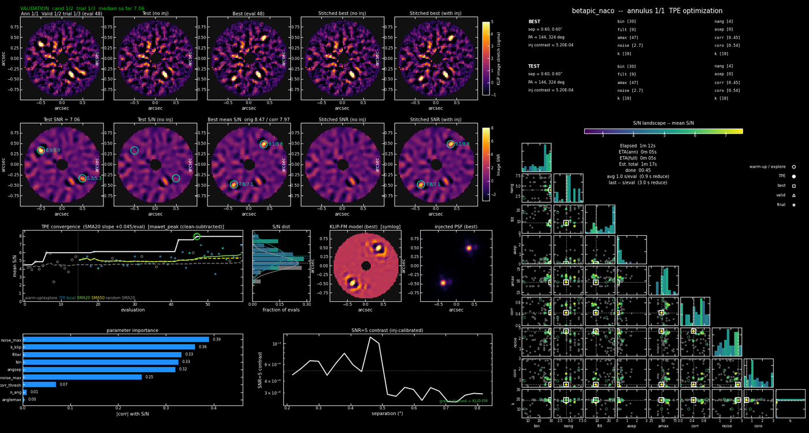

# The live display and the products

Everything klip-tpe shows while it runs and writes when it is done, cell by cell and
file by file.  The panel and the product set are those of the IDL optimizer
(`near2m_show`), so IDL users find the same layout.

## The live panel



Black window, 1850 × 990 px (`window_scale` shrinks it; `show="inline"` puts it in a
Jupyter output cell).  Every evaluation renders one frame (`steps/stepNNNN.png`), on a
worker thread so the evaluation loop never waits for it.

**Top row — images** (KLIP image, σ-stretch, image colour map)

| cell | content |
|---|---|
| Ann *i*/*n* Eval *e*/*N* | this evaluation's reduction *with* the injected companions (the "test") |
| Test (no inj) | the same configuration on the clean cube |
| Best (eval *b*) | the incumbent's injected reduction |
| Stitched best (no inj) / (with inj) | the running stitch over annuli done so far + the incumbent |

**Second row — S/N maps** of the same five images.  Circles mark the injected positions
with `raw/corr` S/N: *raw* is the S/N in the injected image, *corr* the clean-subtracted
score (`s_inj − max(s_clean, 0)`) the optimizer maximises.  The panel title carries the
aggregate (`Test SNR = median`, `Best median S/N orig / corr`).

**Third row**

| cell | content |
|---|---|
| TPE convergence | score per evaluation: warm-up / explore grey, TPE blue, local white; SMA20 (green) and SMA50 (yellow) moving averages, dashed = the random-phase SMA20 baseline, the incumbent circled, the vertical dotted line = end of warm-up |
| S/N dist | histogram of scores (rotated, shares the y axis) |
| KLIP-FM model (best) | the forward-modelled response of the incumbent to the injected companions (built-in engine only; symlog) |
| injected PSF (best) | the injected PSF model, derotated to North-up |

**Fourth row**

| cell | content |
|---|---|
| night inclusion (colour = SNR) | one column per evaluation, one row per partition; a filled cell = partition included, colour = that evaluation's score; the axis grows with the evaluations done (single-partition runs show **parameter importance**, \|corr\| of each parameter with the score, instead) |
| SNR = 5 contrast (inj-calibrated) | the 5σ contrast curve of the incumbent (white), of this evaluation (grey dashed) and the KLIP-FM cross-check (green dashed); validated winners of earlier annuli stay on the plot |

**Right column**

| block | content |
|---|---|
| BEST / TEST | the incumbent's and this evaluation's parameter vectors: separation / PA / contrast of the injections, then every searched parameter per partition (`[k1 k2 …]`), `parts` = the partitions kept |
| S/N landscape | the corner plot of everything sampled so far (colour = score, grey = warm-up, best boxed, current circled); the marginals share the row's axis |
| Elapsed / ETA(ann) / ETA(full) / Est. total / done / avg / last | wall time so far; time left for this annulus and for the run (remaining evaluations at the current per-evaluation time + measured calibration and validation time per annulus + a reserve for pending re-calibrations); elapsed + remaining; the projected wall-clock finish; mean and last loop time per evaluation (with the pure reduction time in brackets) |
| night effect | per partition: median score with it included (white) vs excluded (grey) |
| S/N vs # nights | score against the number of partitions kept |
| legend | warm-up / TPE / best / valid / final markers |

The green header line announces phase changes: `NEW BEST`, `VALIDATION cand c/n trial t/n
median so far …`, `annulus done — VALIDATED winner`.  During validation the Test cells show
the validation trials.  Before the search, the calibration trials are shown
(`steps/calib_annNN_trialNNNN.png`), preceded by the launch movie when `aliens=True`.

## Products of a run directory

```
run_dir/
  run_setup.json / run_setup.txt      configuration, space, instrument
  results.txt / results.jsonl         one row per evaluation (annulus, index, phase, x, k used, score, raw, wall)
  checkpoint.json                     written after every evaluation -> klip-tpe resume
  run.log                             (launcher) the console log
  steps/                              stepNNNN.png live frames, calib_annNN_trialNNNN.png, intro.png
  opt_steps.gif / opt_steps.mp4       the progress movie of the whole run (thinned to <= 400 frames)
  intro_frames/, intro.gif            the launch movie (aliens=True)
  annulusNN/
    calibration.json, calibration_panel.png     contrast calibration ladder
    evals/evalNNNN_{inj,clean}.fits.gz          per-evaluation image crops (render_steps rebuilds frames post hoc)
    eval_NNNN_panel.pdf                         the panel as PDF every pdf_every evaluations
    progress.gif / progress.mp4                 this annulus' movie, rebuilt every movie_every evaluations
    val_candNN_trials.pkl                       validation checkpoints
    validation_panel.png                        the validation stage: candidates x trials
    winner.json                                 the AnnulusResult (winner, validation table, curves, partitions)
    best_inj.fits, best_clean.fits              the winner's images (with / without injections)
    best_*_partitions.fits                      the same per partition
    best_fm.fits                                the KLIP-FM response
    contrast_curve.txt                          5-sigma contrast vs separation (+ KLIP-FM section)
    corner.pdf, landscapes.pdf                  sampled parameter space (scatter corner; TPE good/bad densities)
    parhist.pdf, edf.png, kbook.pdf             parameter histories, score EDF per phase, k requested vs used
    partition_map.png                           inclusion matrix, per-partition S/N, night effect
    importance.pdf, paracoord.pdf, rank.pdf, slice.pdf   which parameters matter (eta^2, parallel coordinates, rank plane, slices)
    products.pdf                                winner images, S/N maps, stitches (p.1), per-partition winners (p.2-3)
    verify_limits.pdf, verify_subsets_inj.pdf, verify_report.txt, verify_curve.txt   the verification stack (--verify)
    param_verify/                               injection-recovery over the top configurations (--param-verify)
    step_display_white.png                      the final panel on white (for papers)
  klip_stitched.fits, klip_stitched_inj.fits     sensitivity-weighted stitch over annuli (clean / injected)
  klip_stitched_snr.fits, _snr_inj.fits          S/N maps of the stitches
  klip_stitched_nights.fits.gz                   per-partition stitches
  klip_stitched_running*.fits                    the running stitch while later annuli are still searched
  klip_stitched_params.txt                       the winner parameters per annulus
  contrast_curve.txt                             run-level curve (all annuli)
  final_results.json                             everything above in one JSON
  cand/                                          blind candidate search (--candidates)
  bench_summary.txt                              one row for benchmark tables
```

`klip-tpe plots --run-dir <dir>` regenerates the diagnostic PNGs (`plots/`);
`klip_tpe.display.plot_annulus_books(run_dir, ia)` the books; `render_steps(run_dir)`
rebuilds the step frames and movie from the saved crops.

## Reading the numbers

* **search score** (`results.txt`, the convergence trace) — the clean-subtracted median
  S/N of the injections of that evaluation.  Optimistically biased: the optimizer picks
  the lucky draws.
* **validated score** (`winner.json: winner_score`, `validation_panel.png`) — the median
  over `n_valid` fresh injection sets of the winner.  This is the number to report.
* **contrast curve** — 5σ, from the injections' recovered throughput at the calibrated
  contrast; the KLIP-FM section is an independent forward-model estimate on the built-in
  engine.
* A `validated = False` winner means no candidate reproduced its search score on fresh
  injections; the run still writes the incumbent's products, flagged as such.
