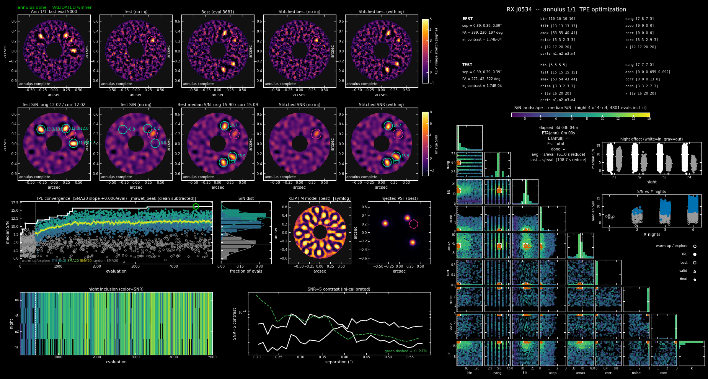

# The live display and the products

Everything klip-tpe shows while it runs and writes when it is done, cell by cell and
file by file.  The panel and the product set are those of the IDL optimizer
(`near2m_show`), so IDL users find the same layout.

## The live panel



Black window, 1850 × 990 px (`window_scale` shrinks it, and `show="inline"` puts it in a
Jupyter output cell).  The window keeps that size for the whole run.  On a screen too small
for it, the window opens at the largest size that fits, and the log says so.  The size is
fixed before the window first appears, so Tk, Qt and GTK windows cannot be resized, and the
window manager does not maximize them.  The panel is drawn pixel for pixel on the screen's
own pixels, at the window's size, so the text stays sharp on a 2× or fractionally scaled
screen and the images keep their shape.  On a GNOME Wayland desktop (Ubuntu, remote-login
sessions included) a Qt or GTK window draws its own frame, and GNOME maximizes such a
window on a double-click of that frame whatever its size limits.  There the window opens
through XWayland, where GNOME's window manager holds its size.  Qt needs `libxcb-cursor0`
for that (`sudo apt install libxcb-cursor0`), and the log says when it is missing.  With
fractional scaling on, the window stays native, because GNOME would enlarge an XWayland
window and blur it.  A double-click can then still maximize the window, and it returns to
its size within half a second.  Tk draws only through X11, so there a Tk window is soft, and
the log says to install PyQt6 for a native one.  `KLIP_TPE_WAYLAND=native` keeps the window native, and
`KLIP_TPE_WAYLAND=x11` sends it through XWayland in every case.  With the macOS backend the
resize control goes when PyObjC is installed (`pip install pyobjc-framework-Cocoa`).  The
run log starts with the klip-tpe version, its git commit and the folder it runs from (the
line `klip-tpe --version` prints).  The live window's line names the backend, the windowing
system and the size (`live window: QtAgg on x11, 1850 x 990 px, fixed size`).  The inline
panel has a fixed size as well, whatever the width of the notebook.  `klip-tpe view` behaves
the same way.  Every evaluation renders one frame (`steps/stepNNNN.png`), on a worker thread
so the evaluation loop never waits for it.

**Top row — images** (KLIP image, σ-stretch, image colour map)

| cell | content |
|---|---|
| Ann *i*/*n* Eval *e*/*N* | this evaluation's reduction *with* the injected companions (the "test") |
| Test (no inj) | the same configuration on the clean cube |
| Best (eval *b*) | the incumbent's injected reduction |
| Stitched best (no inj) / (with inj) | the running stitch over annuli done so far + the incumbent |

**Second row — S/N maps** of the same five images.  Circles mark the injected positions
with `raw/corr` S/N: *raw* is the S/N in the injected image, *corr* the clean-subtracted
score (`s_inj − max(s_clean, 0)`) the optimizer maximises.  The panel title carries the
aggregate (`Test SNR = median`, `Best median S/N orig / corr`).

**Third row**

| cell | content |
|---|---|
| TPE convergence | score per evaluation: warm-up / explore grey, TPE blue, local white; SMA20 (green) and SMA50 (yellow) moving averages, dashed = the random-phase SMA20 baseline, the incumbent circled, the vertical dotted line = end of warm-up |
| S/N dist | histogram of scores (rotated, shares the y axis) |
| KLIP-FM model (best) | the forward-modelled response of the incumbent to the injected companions (built-in engine only; symlog) |
| injected PSF (best) | the injected PSF model, derotated to North-up |

**Fourth row**

| cell | content |
|---|---|
| night inclusion (colour = SNR) | one column per evaluation, one row per partition; a filled cell = partition included, colour = that evaluation's score; the axis grows with the evaluations done (single-partition runs show **parameter importance**, \|corr\| of each parameter with the score, instead) |
| SNR = 5 contrast (inj-calibrated) | the 5σ contrast curve of the incumbent (white), of this evaluation (grey dashed) and the KLIP-FM cross-check (green dashed); validated winners of earlier annuli stay on the plot |

**Right column**

| block | content |
|---|---|
| BEST / TEST | the incumbent's and this evaluation's parameter vectors: separation / PA / contrast of the injections, then every searched parameter per partition (`[k1 k2 …]`), `parts` = the partitions kept |
| S/N landscape | the corner plot of everything sampled so far (colour = score, grey = warm-up, best boxed, current circled); the marginals share the row's axis |
| Elapsed / ETA(ann) / ETA(full) / Est. total / done / avg / last / 1 done every | wall time so far; time left for this annulus and for the run (remaining evaluations at the current completion rate + measured calibration and validation time per annulus + a reserve for pending re-calibrations); elapsed + remaining; the projected wall-clock finish; a trial's own time over the last 50 trials (`avg`) and for the newest (`last`), `eval` from its dispatch until it was processed and `reduce` until its last reduction was back; the interval between two finished evaluations and the trials in flight (`--batch`), which is the throughput and sets both ETAs |
| night effect | per partition: median score with it included (white) vs excluded (grey) |
| S/N vs # nights | score against the number of partitions kept |
| legend | warm-up / TPE / best / valid / final markers |

The green header line announces phase changes: `NEW BEST`, `VALIDATION cand c/n trial t/n
median so far …`, `annulus done — VALIDATED winner`.  During validation the Test cells show
the validation trials.  A trial gets a panel when the render thread is free and goes without
one at once when it is busy, so validation never waits for the display.  Before the search,
the calibration trials are shown
(`steps/calib_annNN_trialNNNN.png`), preceded by the launch movie when `aliens=True`.

## Products of a run directory

```
run_dir/
  run_setup.json / run_setup.txt      configuration, space, instrument
  results.txt / results.jsonl         one row per evaluation (annulus, index, phase, x, k used, score, raw, wall)
  checkpoint.json                     written after every evaluation -> klip-tpe resume
  checkpoint.prev.json                the save before it (a crash of the machine leaves one of the two)
  main_thread_profile.txt             with KLIP_TPE_PROFILE_MAIN=S: where the main thread's time goes
  run.log                             (launcher) the console log
  steps/                              stepNNNN.png live frames, calib_annNN_trialNNNN.png, intro.png
  opt_steps.gif / opt_steps.mp4       the progress movie of the whole run (thinned to <= 400 frames)
  intro_frames/, intro.gif            the launch movie (aliens=True)
  annulusNN/
    calibration.json, calibration_panel.png     contrast calibration ladder
    evals/evalNNNN_{inj,clean}.fits.gz          per-evaluation image crops (render_steps rebuilds frames post hoc)
    eval_NNNN_panel.pdf                         the panel as PDF every pdf_every evaluations
    progress.gif / progress.mp4                 this annulus' movie, rebuilt every movie_every evaluations
    val_candNN_trials.pkl                       validation checkpoints
    validation_panel.png                        the validation stage: candidates x trials
    winner.json                                 the AnnulusResult (winner, validation table, curves, partitions)
    best_inj.fits, best_clean.fits              the winner's images (with / without injections)
    best_*_partitions.fits                      the same per partition
    best_fm.fits                                the KLIP-FM response
    contrast_curve.txt                          5-sigma contrast vs separation (+ KLIP-FM section)
    corner.pdf, landscapes.pdf                  sampled parameter space (scatter corner; TPE good/bad densities)
    parhist.pdf, edf.png, kbook.pdf             parameter histories, score EDF per phase, k requested vs used
    partition_map.png                           inclusion matrix, night effect, score vs number of nights
    importance.pdf, paracoord.pdf, rank.pdf, slice.pdf   which parameters matter (eta^2, parallel coordinates, rank plane, slices)
    products.pdf                                winner images, S/N maps, stitches (p.1), per-partition winners (p.2-3)
    verify_limits.pdf, verify_subsets_inj.pdf, verify_report.txt, verify_curve.txt   the verification stack (--verify)
    param_verify/                               injection-recovery over the top configurations (--param-verify)
    step_display_white.png                      the final panel on white (for papers)
  klip_stitched.fits, klip_stitched_inj.fits     sensitivity-weighted stitch over annuli (clean / injected)
  klip_stitched_snr.fits, _snr_inj.fits          S/N maps of the stitches
  klip_stitched_nights.fits.gz                   per-partition stitches
  klip_stitched_running*.fits                    the running stitch while later annuli are still searched
  klip_stitched_params.txt                       the winner parameters per annulus
  contrast_curve.txt                             run-level curve (all annuli)
  final_results.json                             everything above in one JSON
  cand/                                          blind candidate search (--candidates)
  bench_summary.txt                              one row for benchmark tables
```

The ten books of an annulus (`corner.pdf` to `slice.pdf`, `edf.png` and
`partition_map.png`) are drawn by a separate Python process while the next annulus runs.
It draws them from a snapshot of the annulus' records with the same functions, so the files
are the same as when the run drew them itself, and it runs at a lower priority than the
workers.  The books of an annulus appear a few minutes after it ends, and the run waits for
the last of them at its end.  A Ctrl-C of the run does not stop that process, which finishes
the books and exits.  `KLIP_TPE_BOOKS=inline` draws them on the run's main thread instead.

Each annulus is reduced over its zone padded by 2 px where it meets another annulus, and
its stitch tile overlaps the neighbor by 2 px there.  The inner edge of the innermost
annulus and the outer edge of the outermost are neither padded nor overlapped, so the
reduction and the stitch end where the searched range ends.  `--edge-padding all` pads
those two edges as well, as the IDL does.  A run started before this option existed
resumes with every edge padded.

`klip-tpe plots --run-dir <dir>` regenerates the diagnostic PNGs (`plots/`);
`klip_tpe.display.plot_annulus_books(run_dir, ia)` the books; `klip-tpe render --run-dir <dir>`
(`render_steps`) draws every evaluation's step panel again from the saved crops, including the
ones the live display skipped, into `steps_rebuilt/` with its own movie.

## Reading the numbers

* **search score** (`results.txt`, the convergence trace) — the clean-subtracted median
  S/N of the injections of that evaluation.  Optimistically biased: the optimizer picks
  the lucky draws.
* **validated score** (`winner.json: winner_score`, the star in `validation_panel.png`) — the
  winner's median over `n_rescore` (by default `n_valid`) injection sets drawn after the
  election.  This is the number to report.  The election takes the largest of the candidates'
  medians, each on its own `n_valid` draws, so the elected median is high on those draws, by
  0.22 S/N on average over the annuli of NEAR2's run_20261027_222223 and up to 0.94 in an
  earlier seed.  It stays in `winner.json` as `election_score`.  A lone candidate's median was
  not selected on and stands as it is.  `--n-rescore 0` reports the election's median instead,
  as the IDL does.
* **candidates** — validation re-scores the top `n_top` distinct reductions.  A configuration
  whose clean reduction equals an earlier candidate's, bit for bit, differs only in parameters
  the reduction never reads (a deselected night's, an even high-pass width, frame cuts with no
  frame between them), and is skipped for the next in the search's order.  `winner.json` lists
  the skipped ones as `validation_duplicates`.  `--validation-dedup vector` compares the
  parameter vectors only, as the IDL does.
* **final round** (`--n-final K`, off by default, the diamonds in `validation_panel.png`) —
  the K candidates with the largest validated medians on `--n-final-draws` common draws, the
  same injections for each, and the largest median there elected.  Each first-round median is
  on draws of its own and scatters by a few tenths of S/N, about as far as the top candidates
  lie apart.  On common draws a hard draw is hard for every candidate, so the differences
  scatter far less.  `winner.json: final_round` and `validation_final.json` keep the round.
  The winner's validated score is still its median on fresh draws.
* **contrast curve** — 5σ, from the injections' recovered throughput at the calibrated
  contrast; the KLIP-FM section is an independent forward-model estimate on the built-in
  engine.
* A `validated = False` winner means no candidate reproduced its search score on fresh
  injections; the run still writes the incumbent's products, flagged as such.
